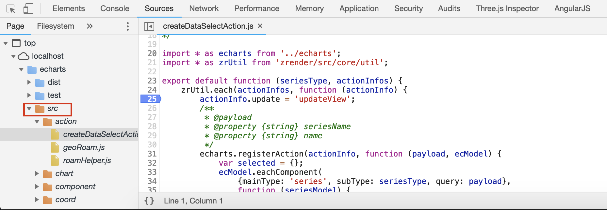

# Contributing

👍🎉 First off, thanks for taking the time to contribute! 🎉👍

Please check out the [Apache Code of Conduct](https://www.apache.org/foundation/policies/conduct.html).

## Issues

When opening new issues, please use the [echarts issue helper](https://ecomfe.github.io/echarts-issue-helper/), opening issues in any other way will cause our bot to close them automatically.

And before doing so, please search for similar questions in our [issues list](https://github.com/apache/incubator-echarts/issues?utf8=%E2%9C%93&q=is%3Aissue). If you are able to reproduce an issue found in a closed issue, please create a new issue and reference the closed one.

Please read the [documentation](http://echarts.apache.org/option.html) carefully before asking any questions.

Any questions in the form of *how can I use echarts to* or *how to use echarts x feature to* belong in [Stack Overflow](http://stackoverflow.com), issues with questions like that in the issue tracker will be closed.

## Release Milestone Discussion

We will start the discussion about the bugs to fix and features of each release in the [mailing list](https://echarts.apache.org/en/maillist.html). You may subscribe our [mailing list](https://echarts.apache.org/en/maillist.html) to give your valuable advice in the milestone dicussion.

About our release plan, we will release a mior version at the end of every month. Here is some detail.

1. Assume our current stable release is 4.3.0. We will start the discussion of milestone of the release two versions ahead, which is 4.5.0 at the beginning of each month. At this time we should also kickoff the developing of the next release, which is 4.4.0.
2. Finish 4.4.0 developing at about 22th of this month and start the testing. And the 4.5.0 milestone discussion is frozen and published on the [GitHub](https://github.com/apache/incubator-echarts/milestone/14)
3. Vote in the mailing list for the 4.4.0 release at the end of this month.

## Pull Requests

### Finding Easy Issues to Fix

You may use [difficulty: easy](https://github.com/apache/incubator-echarts/labels/difficulty%3A%20easy) label to filter issues that we think is easier to fix. These are issues that should be fixed using less time than the average. So if you wish to make some pull requests, this is where you can start with.

You may also filter with [en](https://github.com/apache/incubator-echarts/issues?q=is%3Aopen+label%3A%22difficulty%3A+easy%22+label%3Aen) label for English issues only.

### Coding Standard

Please follow the [coding standard](https://echarts.apache.org/en/coding-standard.html) before you make any changes.

### Git Message Standard

(TBD)

### Contact Us

If you wish to fix a bug or add new features but don't know how, please discuss it with us in the [mailing list](dev@echarts.apache.org).


## How to Debug ECharts

The following steps help you to set up a developing environment for ECharts.


### 1. Clone ECharts project

If you wish to make pull requests, you should **fork the ECharts project** first. Otherwise, just clone it locally.

```bash
git clone git@github.com:apache/incubator-echarts.git
```

[ZRender](https://github.com/ecomfe/zrender) is the rendering library under the hood. You need to clone it along with ECharts.

```bash
git clone git@github.com:ecomfe/zrender.git
```

We assume these projects are downloaded at `~/workspace/echarts` and `~/workspace/zrender`. But their locations can be arbitrary.


### 2. Install dependencies

```bash
cd ~/workspace/echarts
npm install
cd ~/workspace/zrender
npm install
```

Sometimes, in order to fix an issue within echarts, changes have to be made inside the codebase of zrender. To test any changes to zrender locally you can use npm's [npm link](https://docs.npmjs.com/cli/link.html) feature, for example:

```bash
cd ~/workspace/zrender
npm link
cd ~/workspace/echarts
npm link zrender
```

With this, you can see that `~/workspace/echarts/node_modules/zrender` is a link to `~/workspace/zrender`.


### 3. Run and debug

To build the ECharts project and watch source file changes (including ZRender project) to rebuild:

```bash
cd ~/workspace/echarts
node build/build.js --watch
```

To build once:

```bash
node build/build.js
```

Then, open the test cases under `~/workspace/echarts/test` in Web browser. You can add breakpoints under `src` directory. For example, in Chrome Inspect, it looks like:




### 4. Add test cases

In most cases, one or more test cases should be added when developing a feature or fixing a bug.
All of the existing test cases are in directory `~/workspace/echarts/test`.
Check the file `~/workspace/echarts/test/dataZoom-action.html` as an example.

**Organize test cases:**
Each file can be regard as a **test suite** and each chart in the file can be regard as a **test case**,
which contains one or multiple expected results (check points).
If a feature or bug is related to a chart type or a component type, probably it should belongs to
a test file named `chartOrComponentType-someSubCategory.html`. Or some common feature is related
to multiple chart or component or has nothing to do with chart and component, probably it should
belongs a test file named `featureName-someSubCateogory.html`.

**The naming of a test file:**
Generally speaking, the name of the test file should start with a chart type or component type
or a common feature name (like "hoverStyle", "clip").

**Add a test case:**
If intending to add a test case, firstly try to find in the existing test files which file this
new test case might belongs to.
If an existing file found, add the test case to the file.
Otherwise, add a new test file by commands as follows:

```shell
# Make a file named "bar-action.html" in directory "echarts/test" with 1 initial chart.
npm run mktest bar-action
# or `npm run mktest bar-action.html`

# Make a file named "bar-action.html" in directory "echarts/test" with 5 initial charts.
npm run mktest bar-action 5
```

**The expected results and the instructions of user interaction:**
Although we have auto-visual-test tool to run tests, we should better write the expected result
(check points) for each test cases for manual checking.
Some cases need user interactions involved. The instructions should be written clearly.
The expected results and the user instructions should be written in the `title` filed when
creating a test by `testHelper.create` as follows:

```js
var chart = testHelper.create(echarts, 'main0', {
    title: [
        'Hover on the red circle',
        '**A blue label** should appear on the **top of red circle**.'
    ],
    option: option
});
```


### 5. Run test cases

```bash
# puppeteer is not in the devDependencies and needs to be installed manually
npm install puppeteer --no-save
npm run test:visual
```

It will run all the test cases under `~/workspace/echarts/test` automatically to compare with the previous version. You can use this to check if your code bring some breaking change.


### 6. Check the code style

The code style should follow the [Code Standard](https://echarts.apache.org/en/coding-standard.html).

It is recommanded to install [eslint](https://eslint.org) plugin to in your IDE to find the invalid code style.
Otherwise, we can also use
```bash
npm run lint
```
to check the the code style.


### 7. Make a pull request

Fork ECharts project into your own project. Checkout a branch from master branch named `fix-xxxx`, where xxxx is the issue id related. If there's no related issue, you need to create one in most cases to describe what's wrong or what new feature is required.

If you are a committer of apache/incubator-echarts project, which means you have the write access to the project, you still need to push to a new branch (by `git push origin HEAD:refs/heads/fix-xxxx`) and use pull request to push your code. You cannot push code directly to `master` branch, otherwise it will be rejected by GitHub.


## Some hints about using code from other authors

+ About using some algorithms/formulas or inspired by other's work:
    + We can be inspired from other people’s work. There is no problem with copying ideas and no problems associated with that so long as the code is entirely yours and you aren’t violating the license of the inspirational work. You can just follow "normal" source code rules.
    + But when you copy the code, even parts of files, it must remain under the copyright of the original authors.
    + What's the right thing to do for the public good here? I'll go with:
        + Be transparent when implementing an existing idea/algorithm.
        + Reference where that idea/algorithm came from.
        + Use standard language when doing so (we need to define standard language).
            + "inspired by", "learned from" and "references to" are vague concepts in copyright.
        + If any copyrightable expression is copied from the existing idea/algorithm, compare its licensing to our licensing policies and include licensing accordingly.
    + Check the original discussion about it in: https://lists.apache.org/list.html?legal-discuss@apache.org:lte=36M:echarts
+ About adding the license/header of 3rd-party work:
    + https://www.apache.org/legal/src-headers.html#3party
+ Licenses that are compatible with the Apache license:
    + BSD and MIT are compatibal with the Apache license but CC_BY_SA is not (https://apache.org/legal/resolved.html#cc-sa).
+ Stack overflow:
    + before intending to copy code from Stack overlow, we must check:
    + https://apache.org/legal/resolved.html#stackoverflow
    + https://issues.apache.org/jira/browse/LEGAL-471
+ Wikipedia:
    + Wikipedia is licensed CC 4.0 BY_SA and is compatible with the Apache license. So we should not copy code from Wikipedia.
+ Working in progress disclaimer:
    + In some cases we might use the work in progress disclaimer and document the issues in that until they are fixed.
    + https://incubator.apache.org/policy/incubation.html#disclaimers
