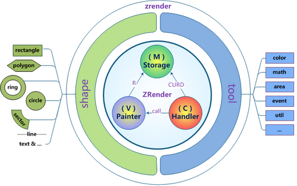

ZRender
=======
http://ecomfe.github.com/zrender

一个轻量级的Canvas类库，MVC封装，数据驱动，提供类Dom事件模型，让canvas绘图大不同！

Architecture
------------
MVC核心封装实现图形仓库、视图渲染和交互控制：
* Stroage(M) : shape数据CURD管理
* Painter(V) : canvase元素生命周期管理，视图渲染，绘画，更新控制
* Handler(C) : 事件交互处理，实现完整dom事件模拟封装
* shape : 图形实体，分而治之的图形策略，可定义扩展
* tool : 绘画扩展相关实用方法，工具及脚手架

特色
----
### 简单
无需canvas基础，精简的接口方法，符合AMD标准，易学易用。

    require(
        ['zrender/zrender'],
        function(zrender) {
            // just init to get a zrender Instance
            var zr = zrender.init(document.getElementById('main'));
            // zr can be used now!
            ...
        }
    );

### 数据驱动
利用zrender绘图，你只需做的是定义图形数据，剩下的事情就交给zrender吧~

哦，对了，差点忘记告诉你，只要在你定义图形数据时设置draggable属性为true，图形拖拽就已经可用了！

    zr.addShape({
        shape : 'circle',
        style : {
            x : 100, 
            y : 100, 
            r : 50, 
            color : 'rgba(220, 20, 60, 0.8)'
        }
    });
    zr.render();
    
### 完整的事件封装
用你再熟悉不过的dom事件模型去操作canvas里的图形元素是件很cool的事情~

你不仅可以响应zrender全局事件，你甚至可以为在特定shape上添加特定事件，后续发生的一切都会按你想的那样去运行~

    zr.addShape({
    shape : 'circle',
    style : {...},
        // 图形元素上绑定事件
        onmouseover : function(params) {concole.log('catch you!')}
    });
    
    // 全局事件
    zr.on('click', function(params) {alert('Hello, zrender!')});
    
### 高效的分层刷新
正如css中zlevel的作用一样，你可以定义把不同的shape分别放在不同的层中，这不仅实现了视觉上的上下覆盖，
更重要的是当图形元素发生变化后的refresh将局限在发生了变化的图形层中，这在你利用zrender做各种动画效果时将十分有用，
性能自然也更加出色~

    zr.addShape(shapeA);    // shapeA.zlevel = 0; (default) 
    zr.addShape(shapeB);    // shapeB.zlevel = 1;
    zr.render();
    
    zr.modShape(shapeB.id, {color:'red'}); 
    // Don't worry! Is merge!
    
    zr.refresh();  
    // Just the level 1 canvas has been refresh~
    
### 丰富的图形选项
当前内置多种图形元素（圆形、椭圆、圆环、扇形、矩形、多边形、直线、曲线、心形、水滴、路径、文字、图片。Will be more..），统一且丰富的图形属性充分满足你的个性化需求！

    var myShape = {
        shape : 'circle',   // sector | ring | rectangle | ...
        zlevel : 1,
        style : {
            ... // color | strokeColor | text | textFont | ... 
        },
        draggable : true
    };

### 强大的动画支持
提供promise式的动画接口和常用缓动函数，轻松实现各种动画需求~

    function MyShape() { ... }

    var shape = require('zrender/shape');
    shape.define('myShape', new MyShape());     // define your shape

    zr.addShape({                               // and use it!
        shape : 'myShape',
        ...
    });
    
### 易于扩展
分而治之的图形定义策略允许你扩展自己独有的图形元素，你既可以完整实现三个接口方法（brush、drift、isCover），
也可以通过base派生后仅实现你所关心的图形细节。

    function MyShape() { ... }

    var shape = require('zrender/shape');
    shape.define('myShape', new MyShape());     // define your shape
    
    zr.addShape({                               // and use it!
        shape : 'myShape',
        ...
    });
    
