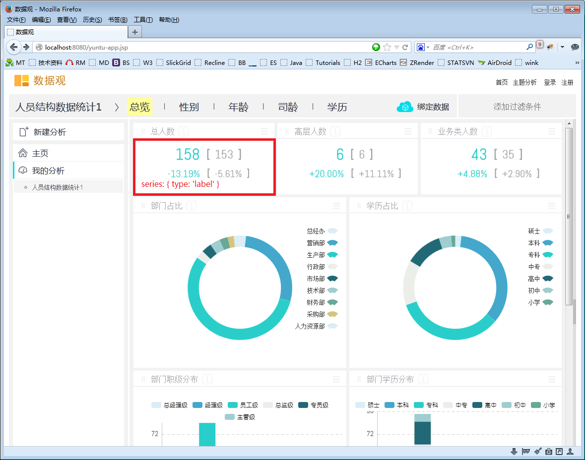

ECharts数据观扩展
=================
http://shujuguan.cn

数据观是一个在线商业数据分析平台。区别于传统BI产品，它采用模板形式，简单易用。
我们扩展主要在以下方面:   
1. 支持数值显示组件(numeric)  
2. 支持数值格式化。包括tooltip，坐标轴等  
3. 多图形布局支持(dashboard)  

数值显示组件(numeric)
-----------------

使用场景



其中红色方框指标渲染option如下(或查看示例[doc/example.html](doc/example.html)):

```
option = {
	"series" : [
		{
			"numericStyle" :
			{
				"textStyle" :
				{
					"fontFamily" : "abelregular,微软雅黑",
					"fontWeight" : 100,
					"fontSize" : 32,
					"color" : "#29ceca"
				},
				"format" : "#,###."
			},
			"layout" :
			{
				"type" : "form",
				"data" :
				{
					"right" :
					{
						"numerator" : 50
					},
					"bottom" :
					{
						"numerator" : 50
					}
				}
			},
			"type" : "numeric",
			"name" : "人数",
			"data" : [158],
			"stack" : "人数"
		},
		{
			"numericStyle" :
			{
				"textStyle" :
				{
					"fontFamily" : "abelregular,微软雅黑",
					"fontWeight" : 100,
					"fontSize" : 20,
					"color" : "#29ceca"
				},
				"format" : "+#.##%;-#.##%"
			},
			"layout" :
			{
				"type" : "form",
				"data" :
				{
					"right" :
					{
						"numerator" : 50
					},
					"top" :
					{
						"numerator" : 50
					}
				}
			},
			"type" : "numeric",
			"name" : "环比",
			"data" : [-0.1319],
			"stack" : "环比"
		},
		{
			"numericStyle" :
			{
				"textStyle" :
				{
					"fontFamily" : "abelregular,微软雅黑",
					"fontWeight" : 100,
					"fontSize" : 24,
					"color" : "#a0a0a0"
				},
				"format" : "#,###."
			},
			"layout" :
			{
				"type" : "form",
				"data" :
				{
					"left" :
					{
						"numerator" : 50,
						"offset" : 20
					},
					"bottom" :
					{
						"numerator" : 50,
						"offset" : 5
					}
				}
			},
			"markText" : [
				{
					"text" : "[",
					"textStyle" :
					{
						"fontSize" : 24,
						"color" : "#a0a0a0"
					},
					"layout" :
					{
						"type" : "form",
						"data" :
						{
							"right" :
							{
								"alignment" : "left"
							},
							"bottom" :
							{
								"offset" : 3
							}
						}
					}
				},
				{
					"text" : "]",
					"textStyle" :
					{
						"fontSize" : 24,
						"color" : "#a0a0a0"
					},
					"layout" :
					{
						"type" : "form",
						"data" :
						{
							"left" :
							{
								"alignment" : "right"
							},
							"bottom" :
							{
								"offset" : 3
							}
						}
					}
				}
			],
			"type" : "numeric",
			"name" : "人数参照",
			"data" : [152.6667],
			"stack" : "人数参照"
		},
		{
			"numericStyle" :
			{
				"textStyle" :
				{
					"fontFamily" : "abelregular,微软雅黑",
					"fontWeight" : 100,
					"fontSize" : 20,
					"color" : "#a0a0a0"
				},
				"format" : "+#.##%;-#.##%"
			},
			"layout" :
			{
				"type" : "form",
				"data" :
				{
					"left" :
					{
						"numerator" : 50,
						"offset" : 20
					},
					"top" :
					{
						"numerator" : 50
					}
				}
			},
			"markText" : [
				{
					"text" : "[",
					"textStyle" :
					{
						"fontSize" : 20,
						"color" : "#a0a0a0"
					},
					"layout" :
					{
						"type" : "form",
						"data" :
						{
							"right" :
							{
								"alignment" : "left"
							},
							"bottom" :
							{
								"offset" : 3
							}
						}
					}
				},
				{
					"text" : "]",
					"textStyle" :
					{
						"fontSize" : 20,
						"color" : "#a0a0a0"
					},
					"layout" :
					{
						"type" : "form",
						"data" :
						{
							"left" :
							{
								"alignment" : "right"
							},
							"bottom" :
							{
								"offset" : 3
							}
						}
					}
				}
			],
			"type" : "numeric",
			"name" : "环比参照",
			"data" : [-0.0561],
			"stack" : "环比参照"
		}
	]
};
```

全部可用参数如下:

```
	var numericSeries =
	{
		type: 'numeric',					// series 类型
		data: [],						// series 数据，只能为单个数值
		layout: {
			type: 'form',				// 布局类型，目前仅支持'form', 参照SWT的FormLayout实现
			data: {
				/*
				x: undefined,			// 被 left 设置覆盖, 或设置值
				y: undefined,			// 被 top 设置覆盖, 或设置值
				width: undefined,		// 被 top 和 bottom 设置覆盖, 设置值，或内容宽度
				height: undefined		// 被 top 和 bottom 设置覆盖, 设置值，或内容高度
				top: {
					series: undefined,	// undefined --> canvas, -1 --> last series, other --> series index
					denominator: 100,	// 分母
					numerator: 0,		// 分子
					offset: 0,			// offset pixels
					alignment: 'top'	// 'top', 'right', 'bottom', 'left', 'center'
				},
				right: {
					series: undefined,	// undefined --> canvas, -1 --> last series, other --> series index
					denominator: 100,	// 分母
					numerator: 100,		// 分子
					offset: 0,			// offset pixels
					alignment: 'right'	// 'top', 'right', 'bottom', 'left', 'center'
				},
				bottom: {
					series: undefined,	// undefined --> canvas, -1 --> last series, other --> series index
					denominator: 100,	// 分母
					numerator: 100,		// 分子
					offset: 0,			// offset pixels
					alignment: 'bottom'	// 'top', 'right', 'bottom', 'left', 'center'
				},
				left: {
					series: undefined,	// undefined --> canvas, -1 --> last series, other --> series index
					denominator: 100,	// 分母
					numerator: 0,		// 分子
					offset: 0,			// offset pixels
					alignment: 'left'	// 'top', 'right', 'bottom', 'left', 'center'
				}
				*/
			}
		},
		numericStyle:
		{
			format : '#,#',				// 格式设置，同Excel
			link : null,				// 超链接跳转
			target : null,				// 仅支持self | blank
			x : 'center',				// 水平安放位置，默认为左对齐，可选为：
										// 'center' | 'left' | 'right'
										// | {number}（x坐标，单位px）
			y : 'center',				// 垂直安放位置，默认为全图顶端，可选为：
										// 'top' | 'bottom' | 'center'
										// | {number}（y坐标，单位px）
			textBaseline : 'bottom',	// 垂直对齐方式，默认根据y设置自动调整
			backgroundColor : 'rgba(0,0,0,0)',
			borderColor : '#ccc',		// 标签边框颜色
			borderWidth : 0,			// 标签边框线宽，单位px，默认为0（无边框）
			padding : 5,				// 标签内边距，单位px，默认各方向内边距为5，
										// 接受数组分别设定上右下左边距，同css
			textStyle :
			{
				fontSize : 64,
				color : '#00cee6'		// 主标签文字颜色
			}
		},
		markText:						// 标注文本数组，每一数组项为markTextItem对象
		[
		]
	};
```

```
	var markTextItem =
	{
		link : null,					// 超链接跳转
		target : null,					// 仅支持self | blank
		x : 'center',					// 文本在标注框(layout)中的显示位置
		y : 'center',					// 文本在标注框(layout)中的显示位置
		textBaseline : 'bottom',		// 垂直对齐方式，默认根据y设置自动调整
		backgroundColor : 'rgba(0,0,0,0)',
		borderColor : '#ccc',			// 标签边框颜色
		borderWidth : 0,				// 标签边框线宽，单位px，默认为0（无边框）
		padding : 5,					// 标签内边距，单位px，默认各方向内边距为5，
										// 接受数组分别设定上右下左边距，同css
		textStyle :
		{
			fontSize : 64,
			color : '#00cee6'				// 主标签文字颜色
		},
		layout: {
			type: 'form',				// 布局类型，目前仅支持'form', 参照SWT的FormLayout实现
			data: {
				/*
				x: undefined,			// 被 left 设置覆盖, 或设置值
				y: undefined,			// 被 top 设置覆盖, 或设置值
				width: undefined,		// 被 top 和 bottom 设置覆盖, 设置值，或内容宽度
				height: undefined		// 被 top 和 bottom 设置覆盖, 设置值，或内容高度
				top: {
					series: undefined,	// undefined --> this series, -1 --> canvas, other --> series index
					denominator: 100,	// 分母
					numerator: 0,		// 分子
					offset: 0,			// offset pixels
					alignment: 'top'	// 'top', 'right', 'bottom', 'left', 'center'
				},
				right: {
					series: undefined,	// undefined --> this series, -1 --> canvas, other --> series index
					denominator: 100,	// 分母
					numerator: 100,		// 分子
					offset: 0,			// offset pixels
					alignment: 'right'	// 'top', 'right', 'bottom', 'left', 'center'
				},
				bottom: {
					series: undefined,	// undefined --> this series, -1 --> canvas, other --> series index
					denominator: 100,	// 分母
					numerator: 100,		// 分子
					offset: 0,			// offset pixels
					alignment: 'bottom'	// 'top', 'right', 'bottom', 'left', 'center'
				},
				left: {
					series: undefined,	// undefined --> this series, -1 --> canvas, other --> series index
					denominator: 100,	// 分母
					numerator: 0,		// 分子
					offset: 0,			// offset pixels
					alignment: 'left'	// 'top', 'right', 'bottom', 'left', 'center'
				}
				*/
			}
		}
	};
```


数值格式化支持
--------------
(未完成)

多图形布局支持(dashboard)
-------------------------
(未完成)

